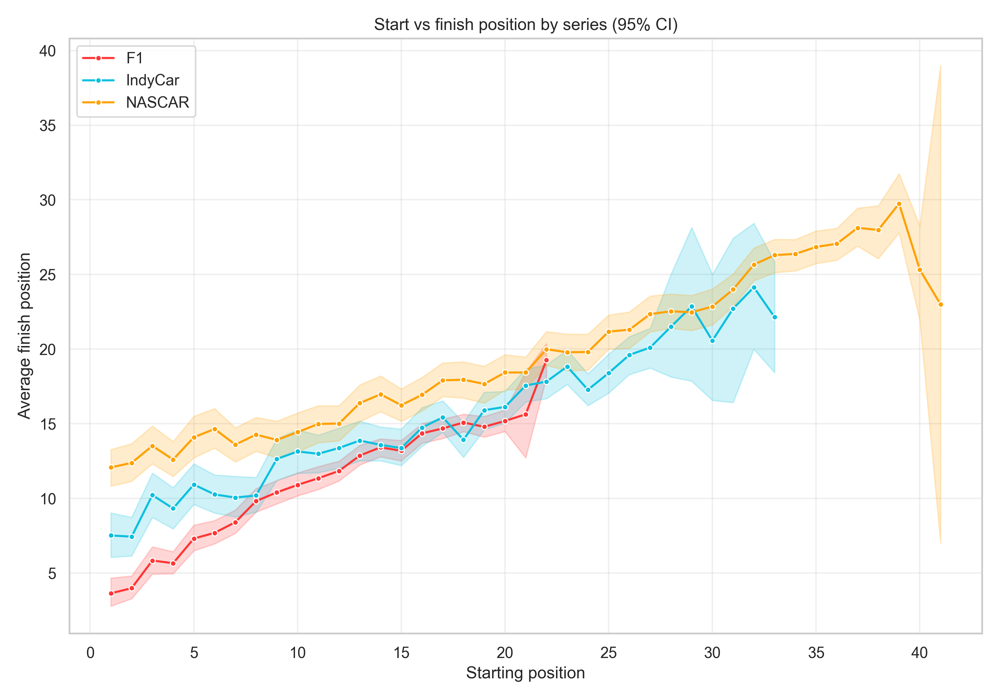
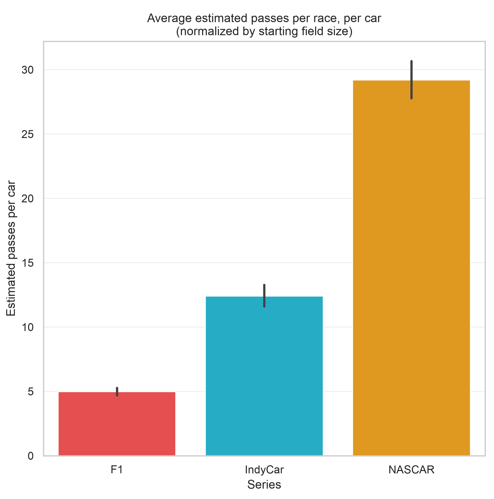
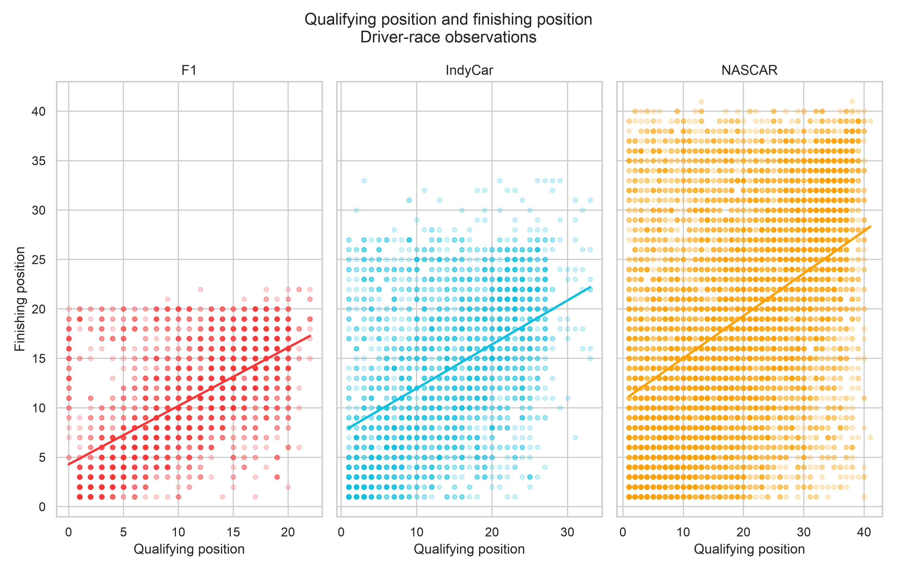
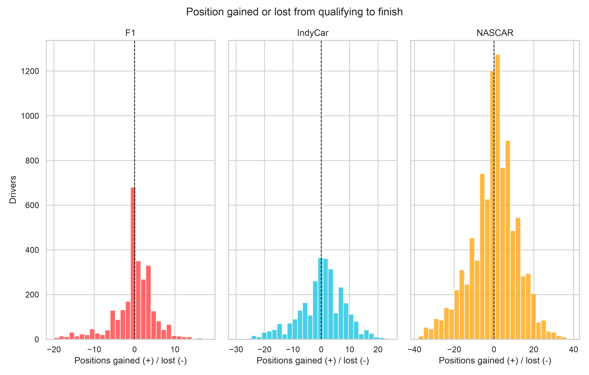
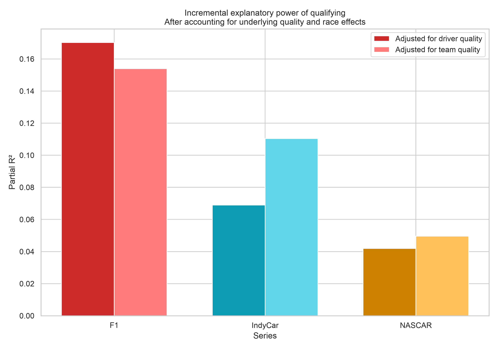
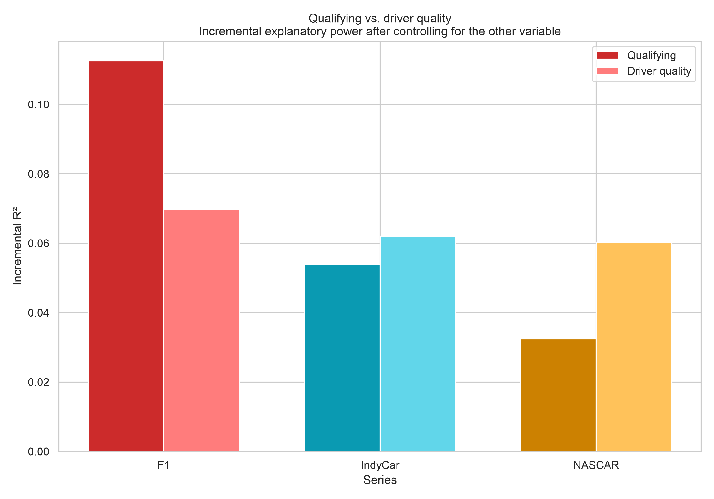
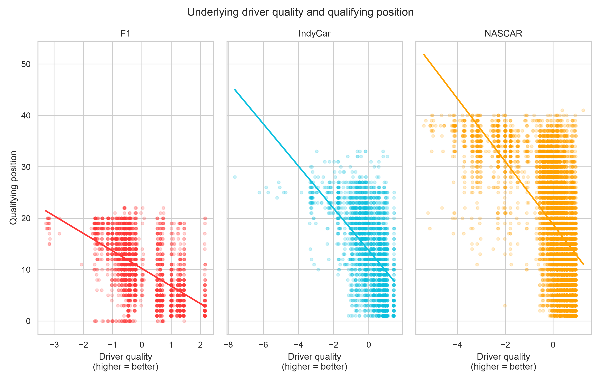
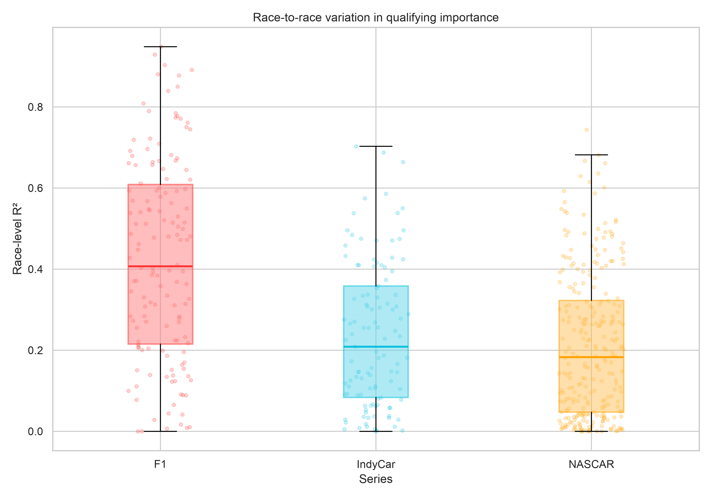

## Introduction

Competitive motorsports are unique compared to other sports because, through qualifying, an advantage can be gained before the day of the event. Formula 1 (F1), NASCAR, and IndyCar all hold qualifying sessions that, on the surface, appear to have varying effects on the results of the race. For example, take two seven-time champions of their respective series: Lewis Hamilton (F1) and Jimmie Johnson (NASCAR). 61 of Lewis Hamilton's 106 race wins [@statsf1_hamilton] came from pole position, compared to a mere 15 of Jimmie Johnson's 83 wins [@motorsportstats_johnson], pointing to potentially drastic differences in the relative importance of qualifying across race series.

So, we aim to quantify the relative importance of qualifying between these three major race series. In doing so, we create a new pip-installable Python package for obtaining lap-by-lap IndyCar data, which was previously unobtainable. Using lap-level information for each series, we adjust for driver performance to isolate the effects and try to gain actionable insight into the differences in race weekend operations across series.

## RaceIndyCar

RaceIndyCar is a Python pip-installable package to obtain and analyze IndyCar data. By scraping information from the official [IndyCar](https://www.indycar.com/) website, we can examine all weekend events and their corresponding sessions.

The specific information we have available depends on the session and release date. For example, not all races have the same number of practice sessions. Additionally, lap-by-lap data is only available for 2013 and beyond (with all data being from 1996-Present).

### Data Collection

Data was obtained using the FastF1 and PyNascar Python libraries. The custom package described below, RaceIndyCar, was created to obtain lap-by-lap data for IndyCar. For each race, general statistics such as start position, finish position, average speed, and more are kept. Additionally, we obtain data for each lap of every race, including each driver's position, lap speed, and lap time.

In an IndyCar season, there are around 17 race events that occur. Each race event typically spans a weekend, where within that event there are individual sessions (such as practices, qualifying, and the race itself). We use this idea of events and sessions in our implementation:

```{python}


import raceindycar

# Enable caching so downloaded and parsed data can be reused.
raceindycar.enable_cache(
    cache_dir=".cache/raceindycar",
    cache_format="pickle",
)

# Get all events for a given year
races = raceindycar.get_season_events(2025)

# Returns an Event with attributes for each schedule column.
# The second argument does a fuzzy name match to find an event,
# or use a round number/integer event id found in the schedule.
indy25 = raceindycar.get_event(2025, "Indianapolis 500")

# Identify all sessions (such as practices and qualifying) for the event.
session_info = indy25.sessions

# Get a specific session from an event.
# The session argument can either be an EventsSessionID or a SessionName string.
race_session = indy25.get_session(session="R")

# Load data for that session.
race_session.load()

# A Pandas DataFrame of race data, including start position,
# finish position, average speed, etc.
race_session.results.sample(n=3, random_state=314).iloc[:, :6]
```

It is not required to get an event and then get a session from that event as shown above. We can go straight to a session for a weekend:

```{python}
det25_race = raceindycar.get_session(
    2025,
    "Detroit Grand Prix",
    session="R",
)
```

From a session, we can obtain the lap-by-lap data, with information on every section of an IndyCar track. Lap results from a given session are scraped from PDFs that are around 500 pages long, so loading laps can take anywhere from 30--100 seconds.

```{python}
#| output: false
race_session.load(laps=True)

# A Pandas DataFrame of each lap, including sectional and position data
laps = race_session.laps
laps.sample(n=3, random_state=314).iloc[:, :6]
```

Additionally, there are some convenience filters for lap data for accessibility. Note that team names and drivers can either be a string or a list:

```{python}
#| include: false
laps.pick_drivers(["12", "2"])  # Use car number or driver name.
laps.pick_teams("Team Penske")

laps.pick_wo_pit()  # Excludes pit-road laps
laps.pick_quicklaps(threshold=1.07)  # Laps within threshold of fastest.
laps.pick_fastest()
example = laps.pick_laps(range(1, 21))
example.sample(n=3, random_state=314).iloc[:, :6]
```

### Package Design and Usage

#### Installation

RaceIndyCar is pip installable, or available on [PyPI](https://pypi.org/project/raceindycar).

```{bash}
pip install raceindycar
```

Requires Python 3.10+. Dependencies (`pandas`, `requests`, `requests-cache`, `pdfplumber`, `matplotlib`) are installed automatically.

#### Plotting

RaceIndyCar also offers six plotting functions with preset colors for drivers and teams. The default arguments for all of these functions will work for the given IndyCar data, but can be manipulated to take in an arbitrary racing dataframe.

The first two plotting functions can be run for drivers of a specified race.

```{python}
#| fig-width: 5 
#| fig-height: 3.5
#| out-width: "60%"
#| fig-align: center
import matplotlib.pyplot as plt
from raceindycar import plotting

det25_race.load(laps=True)

drivers = ["10", "5"]
plotting.setup_mpl()

# Position-by-lap line chart
fig, ax = plotting.plot_position(
    det25_race,
    drivers=drivers,
)
fig.set_size_inches(4, 2.5)

# Lap time line chart
    # fig, ax = plotting.plot_lap_times(
    #    det25_race,
    #    drivers=drivers,
    #)

plt.show()
```

For example, `plot_qualifying_vs_finish` is shown here. In this case, Alex Palou crashed on lap 72, so he does not have a running position afterwards.

Additionally, we can plot information for multiple races:

```{python}
#| fig-width: 5 
#| fig-height: 3.5
#| out-width: "60%"
#| fig-align: center
import pandas as pd

det26_race = raceindycar.get_session(
    2026,
    "Detroit Grand Prix",
    session="R",
)

det26_race.load(laps=True)

combined_results = pd.concat([
    det25_race.results.assign(Year=2025),
    det26_race.results.assign(Year=2026),
])

# Scatter of starting position vs finishing position with trend line
fig, ax = plotting.plot_qualifying_vs_finish(
    combined_results
)
fig.set_size_inches(4, 2.5)

# Histogram of positions gained/lost from start to finish
    #fig, ax = plotting.plot_position_gain(
    #    combined_results
    #)

# Scatter of a results metric vs qualifying position, with trend line
    #fig, ax = plotting.plot_metric_vs_qualifying(
    #    combined_results,
    #    metric_col="PointsEarned",
    #)

plt.show()
```

For example, `plot_qualifying_vs_finish` is shown here.

#### Caching

This library mirrors [FastF1's `Cache`](https://docs.fastf1.dev/api_reference/cache_and_rate_limits.html) API, and there are two stages for caching.

The first stage uses an SQLite table to store HTTP requests and results for [IndyCar](https://www.indycar.com/).

The second stage stores Pickle/CSV files that contain information from loading a race.

Requests are rate limited to around one request per two seconds.

```{python}
from raceindycar.cache import Cache

# Enable Cache with specified directory.
# Use either "pickle" or "csv" format.
raceindycar.enable_cache(
    cache_dir=".cache/raceindycar",
    cache_format="pickle",
)

# Wipe Stage 2 (parsed/pickle) data, keeping the HTTP cache.
# Optionally, wipe all Stage 1 HTTP requests with deep=True.
Cache.clear_cache(deep=False)

# Never hit the network and only use cached data,
# raising an error if the data is not found locally.
Cache.offline_mode(True)

# Temporarily bypass the cache.
with Cache.disabled():
    ...
```

#### Summary and Application

Through utilizing official [IndyCar data](https://www.indycar.com/), RaceIndyCar obtains session-level data, even down to individual section times for every lap. We can store this information for reuse and plot key metrics.

Applying this at a weekend level, we can see how qualifying lap times associate with race lap times for individual drivers. On a multi-race level, we can start to identify patterns and trends to create actionable results, such as identifying optimal practice time, resource allocation to adjusting the car from qualifying to race day, and more.

## Quantifying the Importance of Qualifying

Let $Q_{ir}$, $F_{ir}$ denote qualifying and finishing position for driver $i$ in race $r$, and $L_{ir\ell}$ the lap time on lap $\ell$.

### Pace Normalization

Raw lap times are first converted to a race/lap-normalized pace score,

$$
z_{ir\ell} = \frac{L_{ir\ell} - \text{median}_j(L_{jr\ell})}{\text{sd}_j(L_{jr\ell})},
$$ {#eq-pace}

making pace comparable across tracks and eras.

### Driver and Team Quality

A race-level pace summary $\bar z_{ir} = \text{median}_\ell(z_{ir\ell})$ is then aggregated, leave-one-race-out, into a driver quality score

$$
\text{DQ}_{ir} = -\frac{1}{N_i-1}\sum_{r'\neq r}\bar z_{ir'},
$$ {#eq-driver-quality}

sign-flipped so higher is better, with team quality $\text{TQ}_{ir}$ defined analogously. Excluding race $r$ from its own quality estimate is essential: including it would let a driver's result in $r$ partly explain itself, inflating quality's apparent explanatory power and artificially shrinking qualifying's incremental contribution. Both scores are then z-scored within series ($\text{DQ}^z_{ir}$, $\text{TQ}^z_{ir}$, sample sd) so coefficients are comparable across F1, IndyCar, and NASCAR despite each series having a different raw pace scale.

### Regression Framework

The core analysis fits six nested OLS models per series, each with race fixed effects $\alpha_r$ to absorb track- and event-level heterogeneity (weather, field size, caution frequency) so that qualifying and quality are identified from within-race variation only:

$$
\begin{aligned}
F_{ir} &= \alpha_r + \beta_1 Q_{ir} + \varepsilon_{ir} &&\text{(M1, qualifying only)}\\
F_{ir} &= \alpha_r + \gamma_1 \text{DQ}^z_{ir} + \varepsilon_{ir} &&\text{(M2, driver quality only)}\\
F_{ir} &= \alpha_r + \beta_2 Q_{ir} + \gamma_2 \text{DQ}^z_{ir} + \varepsilon_{ir} &&\text{(M3, both)}\\
F_{ir} &= \alpha_r + \delta_1 \text{TQ}^z_{ir} + \varepsilon_{ir} &&\text{(M4, team quality only)}\\
F_{ir} &= \alpha_r + \beta_3 Q_{ir} + \delta_2 \text{TQ}^z_{ir} + \varepsilon_{ir} &&\text{(M5, both)}\\
F_{ir} &= \alpha_r + \beta_4 Q_{ir} + \gamma_3 \text{DQ}^z_{ir} + \delta_3 \text{TQ}^z_{ir} + \varepsilon_{ir} &&\text{(M6, full)}
\end{aligned}
$$ {#eq-models}

Reduced/full pairs (e.g. M2 vs. M3) are always fit on an identical common sample, so any R² difference reflects the added variable alone rather than sample drift.

### Partial R²

We report both the raw increment and the partial R²,

$$
\Delta R^2 = R^2_F - R^2_R, \qquad
R^2_{\text{partial}} = \frac{R^2_F - R^2_R}{1-R^2_R},
$$ {#eq-partial-r2}

with partial R² as the headline statistic because raw increments aren't comparable across series with different baseline $R^2_R$ — a series where quality already explains most of the variance has structurally less room left for qualifying to add to, and the partial-R² normalization removes that ceiling effect.

### Race-Level Analysis

To check the pooled estimate isn't driven by a handful of races, each race is also fit independently,

$$
F_{ir} = \alpha_r^{(0)} + \beta_r Q_{ir} + \varepsilon_{ir},
$$ {#eq-race-level}

yielding a *distribution* of race-level $R^2_r$ rather than one pooled number, alongside per-race and pooled Spearman's $\rho$ as a distribution-free complement to the linear $\beta_r$. Linear OLS is preferred over rank-based or ordinal alternatives throughout because it yields additive, directly interpretable R² decompositions — the mechanism the incremental/partial-R² comparisons depend on — while Spearman correlation serves only as a robustness check on the same relationship, not a replacement for it.

## Results {#sec-results}

Through our method, we find that position is a meaningful but partial predictor of race outcome, and its importance varies sharply by series. After conditioning on race fixed effects and each driver's underlying pace, qualifying position still adds real explanatory power in all three series, while the size of that effect differs by roughly a factor of two to three between F1 and NASCAR.

### Qualifying and Finishing Position

First, we examine how qualifying position relates to finishing position across the three series. We also look at the amount of position changes that occur from qualifying to finish, which is a proxy for how much variance there is in the race itself. 

@fig-quali-eda shows that in F1, for the high starting positions, has a higher average finish position than the other two series. However, this advantage compared to IndyCar ends at around position 7. NASCAR's curve is flatter compared to the other two series, indicating that average finish positions for many starting positions are similar. 

::: {#fig-eda-raw layout-ncol=2}

{#fig-quali-eda width=60%}

{#fig-passes-eda width=60%}

EDA of qualifying position vs. finishing position and passes per race
:::

In addition, each NASCAR driver performs around 6 times as many passes as an F1 driver and over double the number for IndyCar drivers.

The scatter of qualifying position against finishing position (@fig-quali-finish) shows a clear positive slope in all three series, but with very different amounts of scatter around it. F1's cloud is tightest and most linear; IndyCar and NASCAR show substantially more vertical spread at every starting position, consistent with more frequent late-race reshuffling (strategy, cautions, pit-stop variance) loosening the grid-to-finish relationship. This is echoed in the position-gain histograms (@fig-position-gain): F1 drivers cluster tightly around "no change" from qualifying to finish, while IndyCar and especially NASCAR show wide, roughly symmetric distributions of gains and losses spanning ±20 to ±40 positions — a signature of much higher in-race variance.

::: {#fig-raw layout-ncol=2}

{#fig-quali-finish width=60%}

{#fig-position-gain width=60%}

Raw relationship between starting and finishing position across series.
:::

### Adjusted Qualifying Importance

Using the common-sample specification (`finish ~ driver_quality_z + race FE` vs. `finish ~ qualifying + driver_quality_z + race FE`, identical observations in both models):

| Series  |     n | Races | R² (quality only) | R² (+ qualifying) | Incremental R² | Partial R² |
| :------ | ----: | ----: | -----------------: | ------------------: | --------------: | ---------: |
| F1      | 2,778 |   142 |               0.339 |                0.451 |            0.113 |  **0.170** |
| IndyCar | 2,908 |   113 |               0.218 |                0.272 |            0.054 |  **0.069** |
| NASCAR  | 9,695 |   272 |               0.226 |                0.258 |            0.032 |  **0.042** |

: Common-sample qualifying incremental/partial R², controlling for driver quality and race fixed effects. {#tbl-common-sample}

Qualifying explains roughly **17% of the finishing-position variance left unexplained by driver quality in F1**, versus about **7% in IndyCar** and **4% in NASCAR**. The same ordering holds under the team-quality specification (@fig-partial-r2): partial R² for qualifying is 0.154 (F1), 0.110 (IndyCar), and 0.050 (NASCAR). @fig-quali-vs-quality makes the driver-quality-vs-qualifying comparison directly: in F1, qualifying alone carries roughly as much unadjusted explanatory weight as driver quality; in IndyCar and NASCAR, driver quality's incremental contribution meets or exceeds qualifying's.

::: {#fig-r2-comparisons layout-ncol=2}

{#fig-partial-r2 width=60%}

{#fig-quali-vs-quality width=60%}

Qualifying's incremental explanatory power compared against underlying driver and team quality.
:::

@fig-quality-vs-quali confirms why quality and qualifying are related but not redundant: driver quality (leave-one-race-out relative pace) correlates negatively with qualifying position in all three series (higher quality → better/lower grid slot), most steeply in NASCAR and IndyCar and more moderately in F1. Because faster drivers tend to qualify better, some of qualifying's predictive power is really quality, which is exactly what the driver-quality control is designed to strip out. That qualifying still retains independent explanatory power after this adjustment (particularly in F1) indicates that grid position carries information beyond who's fastest on a given weekend — most plausibly *track-position value*: the tactical advantage of racing near the front (clean air, fewer overtakes required, less exposure to pack incidents), which matters more where passing is harder (F1) and less where it's easier or where race-day variance dominates (NASCAR, and to a lesser extent IndyCar).

{#fig-quality-vs-quali width=60%}

### Race-Level Variation

@fig-race-level shows the distribution of race-level R² (a separate qualifying → finish regression fit within each individual race, no pooling). F1's median race-level R² (~0.41) is roughly double IndyCar's (~0.21) and more than double NASCAR's (~0.18), and F1's IQR sits noticeably higher on the axis. NASCAR shows the widest and most left-skewed spread, with many individual races near R² ≈ 0, which is consistent with our EDA findings of frequent reshuffling and high in-race variance.

{#fig-race-level width=70%}

### Qualifying and Lap 1 Position

As a secondary check, qualifying position correlates very strongly with observed Lap 1 running position (Pearson r = 0.81 F1, 0.92 IndyCar, 0.92 NASCAR), confirming grid position is a faithful proxy for actual race-start position across all three series. Using Lap 1 position instead of qualifying position as the predictor yields even larger partial R² values — 0.257 (F1), 0.087 (IndyCar), 0.048 (NASCAR) — suggesting the true track-position effect is, if anything, slightly understated by using the qualifying result alone rather than the position a driver actually starts from once any grid penalties are applied.

## Discussion

Qualifying proves to have statistically significant predictor of finish position, adjusting for race performance. However, this effect decreases in magnitude from F1 to IndyCar to NASCAR.

Motorsport viewers can take this information to inform decisions about what to watch on a race weekend. For F1 fans, compared to NASCAR or IndyCar fans, because 17% of the variability in finish position not explained by driver skill can be explained by qualifying position, it is more important to tune in to qualifying sessions because of its importance to race day. It also gives NASCAR and IndyCar fans more hope for their drivers who qualify poorly, as it only accounts for 4 and 6 percent of the aforementioned variability.

Additionally, these results can inform new viewers about their desired series to watch, and for the series themselves, what events they can market. If they enjoy watching qualifying and with that, a larger time investment in the sport, then perhaps F1 is the series to watch for them, as it has a larger effect on race day results than IndyCar or NASCAR. On the other hand, if they only want to watch an exciting race, then IndyCar and/or NASCAR is the way to go because there is more variance in finish position from start position, meaning there is more passing and more excitement for the viewer on a lap-by-lap basis. This is supported by the average number of passes for F1, IndyCar, and NASCAR races, which are 5, 12, and 29, respectively.

For the same reasons, F1 teams, relative to NASCAR and IndyCar teams, should be putting more effort into creating a solid qualifying performance because it has a larger effect on race results.

F1 drivers should be super aggressive on lap one. The difference in the predictive value for qualifying position and lap one position is 8.7%, whilst only being 1.8% and 0.6% for IndyCar and NASCAR. These drivers can take a more relaxed approach to the first lap, as it is not devastating to informing race results.

## Limitations and Future Work

Differing weather conditions between qualifying and race day were not accounted for in this analysis. For the future, incorporating weather into the analysis can inform teams on how to adjust strategy based on varying conditions. We also did not create a function for teams to identify specifically the impact of adjustments for specific scenarios. For example, it would be helpful for a team to know if an $x$ increase in race speed for a $y$ position trade-off in qualifying will be worth it because they will gain back those lost positions.

## Conclusion

Overall, this project creates new opportunities for data analytics in the IndyCar realm through the raceindycar package and offers a novel method of comparing races across series through our numerical analysis.

## References {.unnumbered}

:::{#refs}

:::
